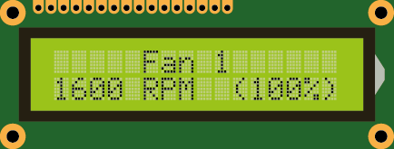
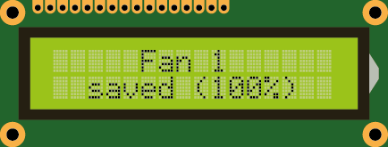
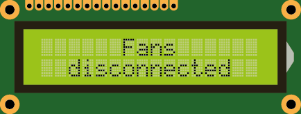
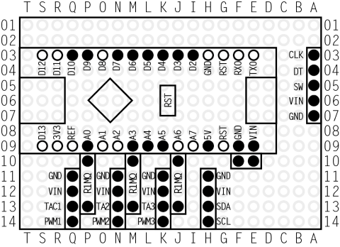
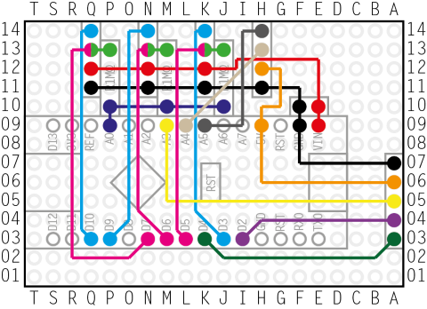
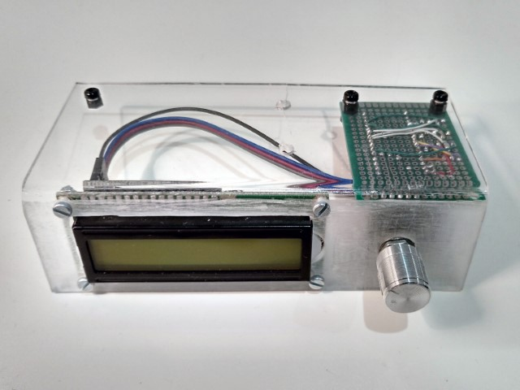
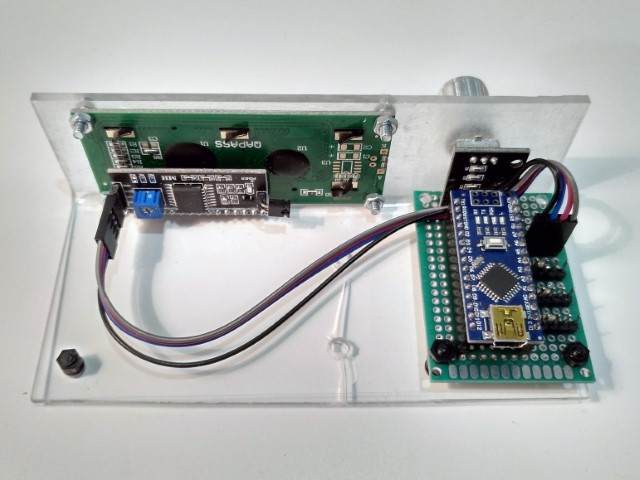
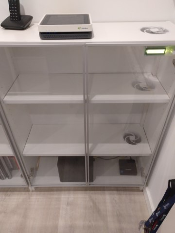
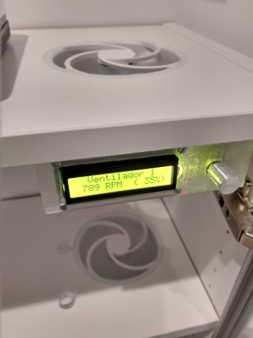

# Arduino PWM Fan Controller

This is a home project for controlling up to three PWM capable fans by setting their rotating speed manually. The prototype uses two peripherals for I/O: a rotary controller to select and configure the fans, and an LCD screen to report on the fans status and the configured duty cycle.

## How to use

The device is simple to use: just simply connect the PWM capable fans to the board, and power it using a 12 V DC power supply. The device uses an LCD screen to show information. The LCD screen turns off automatically after 5 seconds. It turns on again when the rotary encoder is rotated or pushed.

On first run, the fans will rotate at the 100% of their max speed. The "active" fan, the actual rotating speed, and the configured % of the max speed are shown in the LCD screen (see `include/Messages.h` to localize the messages):

The speed of the fan shown in the LCD screen will be changed by rotating the rotary encoder clockwise (to increase the speed) or counter clockwise (to reduce the speed) in increments of 5%.

Fan speed can be saved by long-pressing the rotary encoder button (between 2 and 5 seconds). The current speed will be saved in the Arduino's EEPROM and will be restored on the next reboot.

The active fan (i.e., the one shown in the screen, and the one whose speed will change when rotating the rotary encoder) can be changed by short pushing the rotary encoder button (less that 2 seconds) if the screen is on. The active fan will change to the next available fan. 

The device allows controlling up to three PWM-capable fans, but only those that are connected on system startup will be shown in the LCD screen when the active fan changes. That is, if only Fans 1 and 2 are connected when the device is powered on, pushing the rotary controller for less than two seconds will change the active fan from 1 to 2, and when pushing again, from 2 to 1. Fan 3, which is disconnected, will be skipped. When a fan gets disconnected during normal operation, the fan will be reported as rotating at 0 RPMs. If not fans are connected on device boot, no fans will be shown:

## Bill of Materials

| Qty | Description                        |
|:---:|------------------------------------|
|   1 | PCB                                |
|   1 | Arduino nano                       |
|   3 | PWM-capable Fans                   |
|   3 | 1 MOhm resistor                    |
|   1 | Rotary Controller with push button |
|   1 | LCD Screen (16x2 characters)       |
|   - | Dupont connectors & cables         |

## Pinout

Next you'll find the pins that are being used from the Arduino nano board. These can be configured in `include/Globals.h`. Keep in mind that tachometer pins are supposed to used PCINTs, so keep this in mind when changing these pins. Also, PWM pins must be kept unchanged. See https://fdossena.com/?p=ArduinoFanControl/i.md for an explanation on how the PWM signals are generated.

| Name                 | Pin | Description
|----------------------|:---:|-------------
| PWM Fan 1            | D10 | PWM line of the Fan 1 (square wave, 25 KHz)
| PWM Fan 2            | D9  | PWM line of the Fan 2 (square wave, 25 KHz)
| PWM Fan 3            | D3  | PWM line of the Fan 3 (square wave, 25 KHz)
| Tachometer Fan 1     | D7  | Sensor to measure the speed of Fan 1 (2 pulses per revolution)
| Tachometer Fan 2     | D6  | Sensor to measure the speed of Fan 2 (2 pulses per revolution)
| Tachometer Fan 3     | D5  | Sensor to measure the speed of Fan 3 (2 pulses per revolution)
| Test Fan Connected   | A0  | Line where a test signal is transmitted on boot, to detect disconnected fans (cannot detect stopped fans)
| SDA (LCD Screen)     | A4  | SDA signal of the I2C bus, connected to the LCD screen
| SCL (LCD Screen)     | A5  | SDA signal of the I2C bus, connected to the LCD screen
| SW (Rotary encoder)  | A3  | Push button of the rotary encoder
| DT (Rotary encoder)  | D2  | Data signal of rotary encoder
| CLK (Rotary encoder) | D4  | Clock signal of rotary encoder

## PCB Design

This is the front design. Black circles designate connections in the PCB. White circles are unused pins.

Next the wiring (in the back of the board) is shown. I used color codes to differentiate the different wires and connections. I opted for using a small PCB, which makes the wiring a bit complicated with several crossing lines (sorry!).

## Result

After building the circutry, assemble everything in a base. I normally use methacrylate since its hard, allows high temperatures without melting, is quite easy to bend, and can be easily machined with a dremmel...

However, is a bit fragile (notice the crack).

In my case, I dont care too much about the crack, since it cannot be seen in its final location: a bookcase where I keep different computers, switches, NAS, etc.

